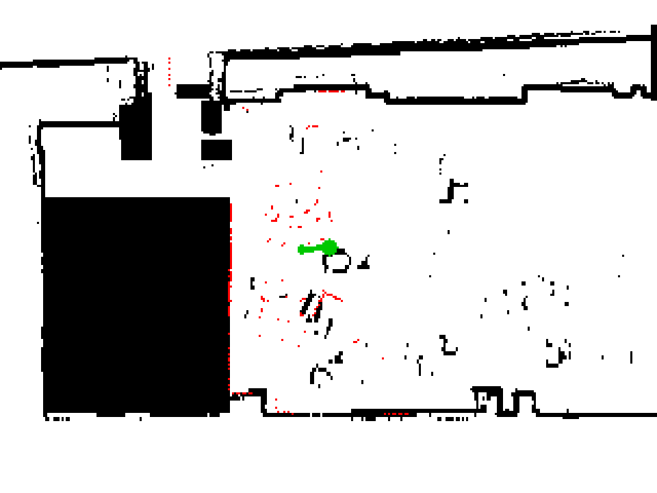
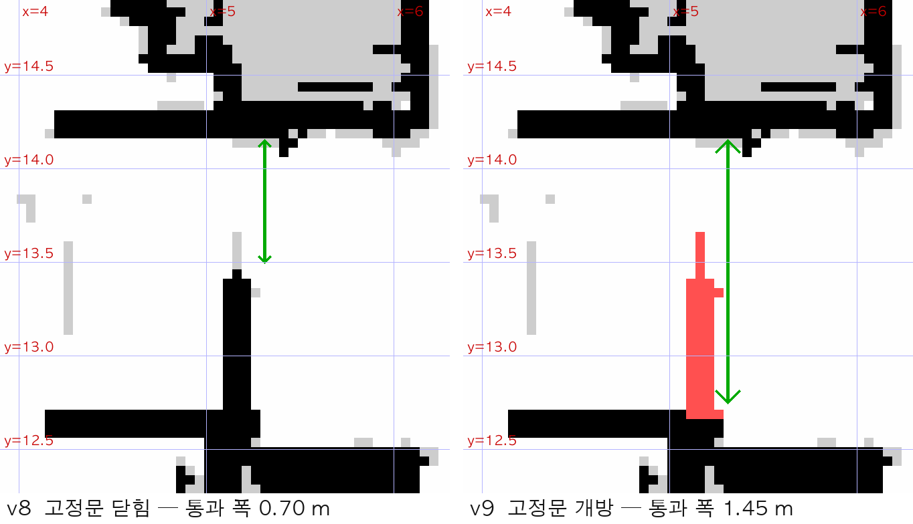
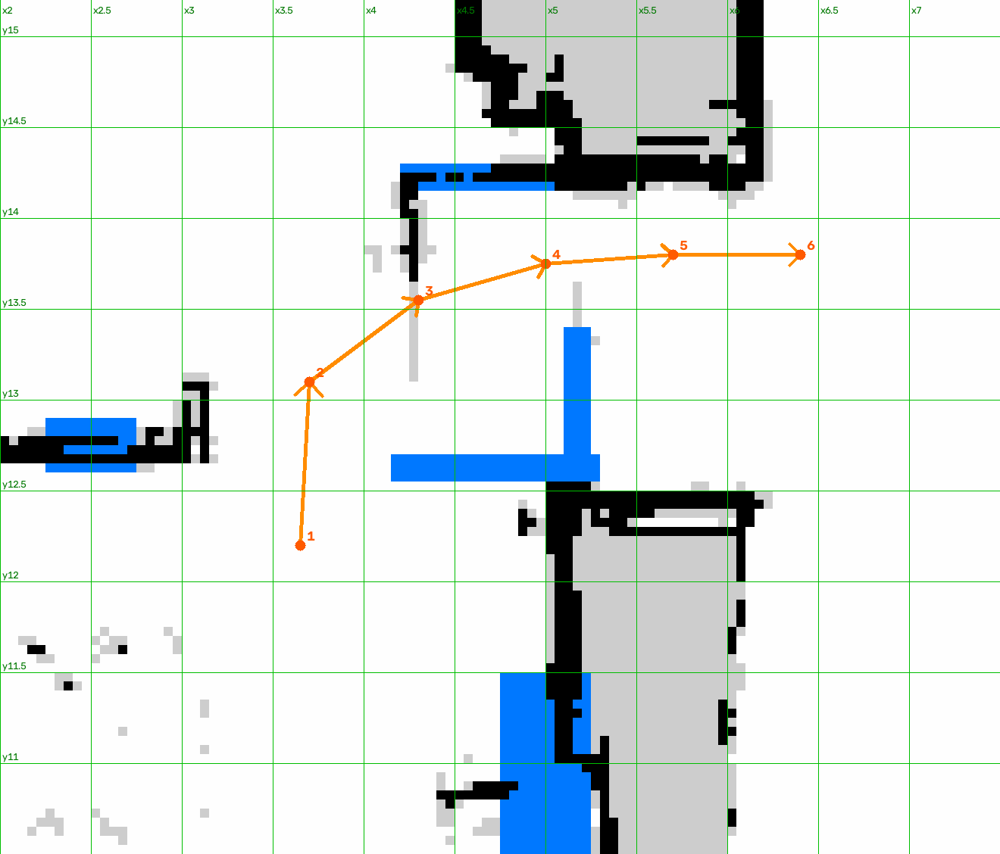
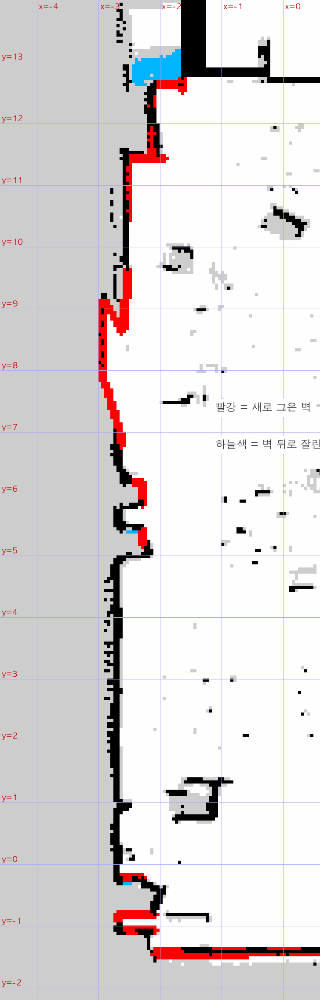
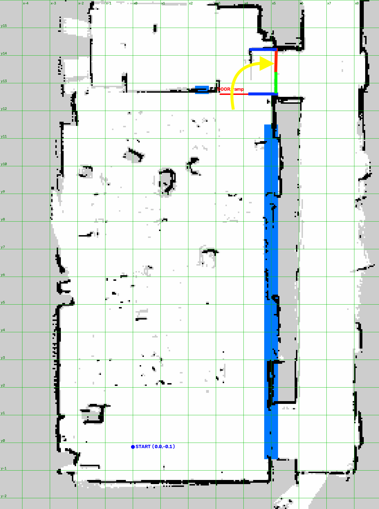

# LIMO 2D SLAM & Nav2 — Map Repair Toolkit

Tools and map artifacts from getting an **AgileX LIMO Pro** to drive autonomously
between a lecture room and a corridor, through a doorway that is only partly
passable.

The navigation stack itself is stock ROS 2 Humble (Cartographer + Nav2 + AMCL).
Everything in this repository exists because **the stock stack failed on maps that
looked fine**, and the failures turned out to be map problems rather than
parameter problems. The tools here diagnose and repair occupancy grids offline,
on a laptop, without occupying the robot.

**Platform:** NVIDIA Jetson Orin Nano · Ubuntu 22.04 · ROS 2 Humble · YDLIDAR
Tmini Plus (±110° field of view)

---

## Tech stack

- **ROS 2 Humble** — Nav2, AMCL, Cartographer, `nav2_map_server`,
  `robot_localization` (EKF)
- **Python 3** with **OpenCV**, **NumPy**, **PyYAML** — all map processing
- Maps are standard ROS occupancy grids (`.pgm` + `.yaml`, 0.05 m/cell)

The Python tools have no ROS dependency. They read and write map files and
LiDAR/costmap dumps captured with `ros2 topic echo`, so they run on a laptop
while the robot stays free.

---

## Why the maps needed repairing

Three distinct failure modes showed up, and each one produced a tool:

**1. Merged maps distort.** Two separately-mapped areas registered together
accumulate global distortion. The room+corridor merge landed at **76.8 cm RMS**
over the clicked correspondence points, because the corridor map closed no loops
and was effectively dead-reckoned. AMCL could still report a confident-looking
covariance while being **2.9 m away from the truth** — measured by scoring the
live scan against the map at both the claimed pose and the true pose:

| Pose | Scan-to-map score |
|---|---|
| Where AMCL claimed to be | 0.058 |
| Where the scan actually fit | 0.719 |

The conclusion — recorded here because it is the most useful thing the project
produced — is that **AMCL covariance measures particle agreement, not accuracy**.
The real check is whether the laser scan overlays the walls.

**2. Unobserved walls read as free space.** A wall the LiDAR never saw from
behind is written as `unknown`, and Nav2's planner is configured with
`allow_unknown: true`, so it happily routes the robot through it. In the corridor
this was **355 rows with no wall at all** (120 east, 235 west), which is what made
the planner cut a shortcut through the grey band beside the corridor.

**3. Furniture moves.** A region that was open during mapping and is now blocked
makes the planner generate the same doomed route every time. Masking such regions
is not about collision avoidance — it is about **not planning through them**.

---

## Tools

| Script | What it does |
|---|---|
| `merge/merge_maps2.py` | Merge two occupancy grids via clicked correspondence points (SE(2) fit). Sequential single-window UI to work around macOS window stacking. |
| `merge/merge_maps.py` | Earlier merge implementation, both windows at once |
| `merge/map_editor.py` | Combined map editor GUI: rectangle / line / erase / unknown, zoom to cursor, pan, live px↔map coordinate readout |
| `merge/close_hallway.py` | Interpolate missing corridor walls from observed wall fragments |
| `merge/scan_locate.py` | Recover the robot's map pose from a **single** LiDAR scan by grid search |
| `merge/edit_mask.py` | Edit masks with real costmap observations overlaid in red |
| `merge/mask_rect.py` | Apply masks by exact pixel coordinates (reproducible, and the command records *why*) |
| `merge/mask_map.py` | Drag-to-mask rectangles |
| `merge/draw_walls.py` | Draw wall lines / erase openings |
| `run_lab.sh` | One-shot bring-up on the robot: teleop → Nav2 → initial pose |

### `scan_locate.py` — recovering from a bad AMCL convergence

When AMCL converges wrongly, clicking *2D Pose Estimate* in RViz is too imprecise
for a 0.55 m doorway. This tool grid-searches `(x, y, yaw)` for the pose that best
lays the scan endpoints onto the map's **wall boundaries**, and prints a ready-to-
run `/initialpose` command.

```bash
# on the robot — BEST_EFFORT and --full-length are both required
ros2 topic echo /scan --qos-reliability best_effort --once --full-length > scan.yaml

# on the laptop
python3 merge/scan_locate.py merge/full_v9.yaml scan.yaml \
    --xmin -7 --xmax -1 --ymin 0.3 --ymax 5
```

It matches against boundaries rather than filled area on purpose: masked
rectangles are solid, so a fill-based score is degenerate — every pose inside a
mask scores well. The tool writes `*_match.png` so the fit can be verified by eye,
which is not optional.



### `close_hallway.py` — interpolating missing walls

For each row it finds where free space ends, records an "anchor" if occupied
cells exist just outside it, and linearly interpolates walls for rows that have
none.

Two constraints make the result safe to navigate on:

- If an interpolated wall would land *inside* the corridor, it is pushed back out
  to the free-space boundary. **Observed free space is never reduced.**
- Gaps longer than 3 m are skipped and logged, since they may be real openings.

Drawing straight lines instead would have been simpler and wrong: the real walls
are not straight, with anchors ranging over x 7.9–8.6 m. An arbitrary straight
line would sit up to 60 cm from the real wall and break AMCL's scan matching.

---

## Map lineage

All maps are 0.05 m/cell.

### Merged lineage (superseded)

| Map | Size | Notes |
|---|---|---|
| `room_v2` | 638×327 | Lecture room, mapped alone |
| `hallway` | 252×612 | Corridor, mapped alone, zero loop closures |
| `merged` | 646×390 | SE(2) merge, `--dx -6.1692 --dy 5.7720 --dtheta 99.2632`, 76.8 cm RMS |
| `merged_ramp2` | 646×390 | Masked ramp edges and unreachable regions |

### Single-session lineage (used for navigation)

Re-mapping the room, doorway, and corridor in **one Cartographer session**
removed the merge distortion, the furniture mismatch, and most of the masking at
once.

| Map | Size | Change |
|---|---|---|
| `full_20260812` | 306×697 | Single-session map, corridor walls single-thickness (loop closure succeeded) |
| `full_v5` | 306×697 | Fake openings sealed, ramp drop-offs and the fixed door leaf marked |
| `full_v8` | 306×697 | Corridor walls interpolated and finished by hand |
| `full_v9` | 306×697 | Fixed door leaf removed after it was physically unlocked |

`full_v9` is the map used for navigation. **If the fixed door is locked again,
revert to `full_v8`** — a map that shows an opening which is actually blocked
makes the planner keep routing into it, whereas the reverse merely costs
clearance.



---

## Results

**Autonomous navigation from inside the lecture room, down the ramp, through the
doorway, into the corridor — completed.**

### The doorway

The double door has a **fixed right leaf**. Centring on the corridor aims the
robot straight into it; this was the first failure.

| | `full_v8` (door locked) | `full_v9` (door open) |
|---|---|---|
| Passable width | 0.70 m | **1.45 m** |
| Centre line | y 13.82 | **y 13.45** |

At 0.70 m the first attempt used y 13.55, leaving only 14 cm of margin against
the fixed leaf — with a robot half-width of 12.5 cm, the front right wheel caught
it. y 13.81 was the working line.

Because NavFn ignores the orientation of intermediate waypoints, a head-on
approach has to be forced with `follow_waypoints` rather than
`navigate_through_poses`:

```
(3.65, 12.20) -> (3.80, 13.40) -> (4.60, 13.81) -> (5.80, 13.81) -> (6.50, 13.70)
```



### Corridor wall repair

| | Rows with no wall |
|---|---|
| `full_v5` | 355 (120 east, 235 west) |
| `full_v6` (after `close_hallway.py`) | 90 (0 east, 90 west) |
| `full_v8` (after manual finishing) | 0 |



### Localization limits, measured

After a convergence run (spin in place plus 2 minutes of driving) on the merged
map:

- `sigma_x` 0.08–0.25 m, `sigma_y` 0.08–0.17 m, `sigma_yaw` 5–9°
- It never went below 0.10 m — the 76.8 cm map RMS sets the floor

Spinning in place converges better than translating, because the ±110° LiDAR
field of view sees only what is ahead from a fixed heading, while one full
rotation sweeps every surrounding wall.

### Map verification routine

Every edit is checked in this order, and the last item is the one that catches
real mistakes:

1. Free-cell count — did the edit eat drivable space?
2. Rows with no wall, over the corridor x range
3. Doorway opening width and clearance on the transit line
4. Minimum free width along the corridor
5. **Flood fill from the room centre across free cells only**

Step 5 must use free cells only. Everything outside the map is `unknown` and
therefore mutually connected, so a flood fill that includes `unknown` always
reports a leak and is useless as a test.



---

## Repository layout

```
merge/          tools, map versions, and the figures above
run_lab.sh      one-shot bring-up script for the robot
```

The working directory this came from also contains scan dumps, costmap dumps, and
debugging screenshots from individual sessions; those are intentionally not
tracked.
